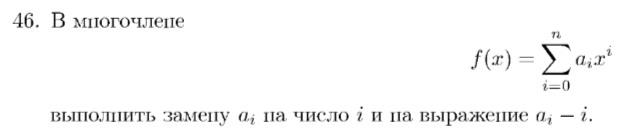
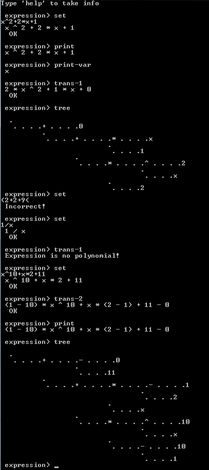

# Отчет по лабораторной работе № 24
## по курсу "Алгоритмы и структуры данных"

Студент группы М8О-108Б-23 Власко Михаил Михайлович

Работа выполнена

Преподаватель: каф. 806 Севастьянов Виктор Сергеевич

1. **Тема**: Деревья выражений
2. **Цель работы**: Составить программу выполнения заданных преобразований арифметических выражений с
применением деревьев.
3. **Задание (Вариант №46)**: 

4. **Идея, метод, алгоритм решения задачи**:
    - Составить программу на языке Си, реализующую:
        - структуры строки, бинарного дерева, дека.
        - функции первичной обработки вводимого выражения с помощью дека и его преобразования в дерево.
        - функции обработки выражения, являющегося многочленом, в соответствии с вариантом.
        - функции печати выражения и его дерева.
        - главную функцию работы с выражениями с помощью командной строки.
5. **Сценарий выполнения работы**:
    1. Взять структуры и функции, реализующие строку (работа №КП/9), бинарное дерево (работа №23) и дека (работа №26).
Изменить структуру узлов дерева и дека, чтобы их узлы имели тип строки из КП9.
   2. Реализовать функцию первичной обработки выражения: посимвольное считывание и помещение элементов выражения в дек,
помещение элементов отдельно (скобки, операторы, многосимвольные операнды).
   3. Реализовать функцию обработки дека и преобразования в дерево. Проверка выражения на корректность (незакрытые 
скобки, идущие подряд операторы и т. д.). Рекурсивное преобразование функции по принципу:
      - Если в деке один операнд, вернуть лист бинарного дерева со значением этого операнда.
      - Для данного дека идти справа налево и отмечать первый оператор с наименьшим приоритетом.
      - Если скобки встретились не с края, элементы в скобках не рассматривать.
      - Образовать узел бинарного дерева, со значением отмеченного оператора.
      - Разделить дек на два дека - левее и правее отмеченного оператора.
      - Применить к полученным декам рекурсивную функцию.
      - Дерево, полученное применением функции к левому деку, сделать левым поддеревом образованного узла,
правому деку - правым поддеревом.
      - Вернуть образованный узел. 
    4. Реализовать функцию проверки дерева выражения на многочлен от данной переменной (отсутствие деления на 
переменную, возведения в степень переменной и т. д.).
    5. Реализовать функцию преобразования дерева многочлена двумя способами в соответствии с вариантом. Рассмотреть
преобразование узла отдельно, если узел - константа, переменная без коэффициента, переменная без коэффициента в
степени. переменная с коэффициентом без степени, переменная с коэффициентом в степени.
   6. Реализовать рекурсивную функцию преобразования выражения из дерева в дек для дальнейшей печати. При рассмотрении
очередного узла, если оператор - значение узла-родителя - по приоритету выше, чем оператор в данном узле,
к участку выражения, составляющего данный узел при преобразовании добавлять скобки.
   7. В главной функции реализовать ввод выражения, ввод переменной (как выражения), которая будет считаться переменной
многочлена, печать выражения и переменной, печать дерева выражения, два вида преобразований.

6. **Листинг**:
   - Пример работы алгоритма:
   

   

   - Файлы с исходным кодом программы на языке Си и Makefile: [dev](dev).

7. **Замечания автора** по существу работы: отсутствуют.
8. **Выводы**: Составлена и отлажена программа обработки выражений с помощью дерева, заданных преобразований многочлена.
Получен опыт обработки выражений с помощью динамических структур данных, повторного использования структур, 
разработанных в предыдущих работах.