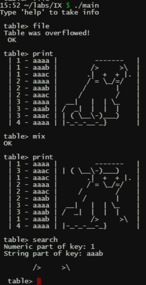

# Отчет по лабораторной работе № КП IX
## по курсу "Алгоритмы и структуры данных"

Студент группы М8О-108Б-23 Власко Михаил Михайлович

Работа выполнена

Преподаватель: каф. 806 Севастьянов Виктор Сергеевич

1. **Тема**: Сортировка и поиск
2. **Цель работы**: Составить программу на языке Си м использованием процедур и функций для сортировки таблицы заданным 
методом и двоичного поиска по ключу в таблице.  
3. **Задание (Вариант №1/8)**: Линейный выбор с обменом, ключ - строка + целое, 8 байт, хранение данных и ключей вместе,
число элементов в таблице до 10.

4. **Идея, метод, алгоритм решения задачи**:
    - Составить программу на языке Си, реализующую:
        - структуры строки, комбинированного ключа, строки таблицы и самой таблицы.
        - функции обработки строк, реверса, перемешивания и сортировки строк таблицы.
        - функции заполнения таблицы с клавиатуры, случайными элементами или чтением из текстового файла.

5. **Сценарий выполнения работы**:
   1. Реализовать структуру строки, представленной двунаправленным списком ссылочно связанных символов, реализовать
функции создания строки, добавления символа к строке, сравнения строк, печати и очистки строки, генерации строки из
случайных символов, итератора для прохода по строке.
   2. Реализовать структуру ключа, содержащую поля хранения целой и строковой частей ключа.
   3. Реализовать структуру строки таблицы, содержащую поле ссылки на ключ и поле ссылки на строку содержимого.
   4. Реализовать структуру таблицы, содержащую поле размера таблицы и поле с массивом ссылок на строки таблицы из
10 элементов.
   5. Реализовать функции ввода отдельной строки с клавиатуры, с сокращением введённой строковой части ключа до 4 
символов (4 байта + 4 байта на целую часть), генерации строки со случайным ключом и содержимым, считывания строк из
текстового файла и конвертации их в строки таблицы (целая и строковая часть ключа и данные разделены в текстовом файле
табуляцией). Во всех вышеозначенных функциях реализовать проверку на переполнение таблицы и существование ключа до 
момента ввода для каждого вводимого элемента.
   6. Реализовать функцию печати таблицы с расчётом отступа перед данными для выравнивания столбцов.
   7. Реализовать функции обмена строк местами, перемешивания строк между собой путём случайных перестановок, реверса
таблицы путём обмена местами всех строк.
   8. Реализовать функцию сортировки методом линейного выбора с обменом, при которой последовательно просматриваются
все элементы, и очередной первый элемент заменяется на минимальный из расположенных впереди, после чего текущий первый
элемент исключается из рассмотрения, и первым становится следующий после него элемент.
   9. Реализовать функцию бинарного поиска, при котором таблица сначала сортируется, а затем последовательно делится
надвое, с проверкой отношения значения искомого ключа и ключа, расположенного посередине рассматриваемой части таблицы.
На каждой последующей итерации рассматривается половина, ограниченная снизу ключом, меньшим искомого, а сверху -
большим искомого. Сравнение ключей происходит по целым частям, а в случае их равенства - лексикографически по строковым
частям.
   10. В главной функции с помощью бесконечного цикла реализовать обработку команд работы с таблицей.

6. **Листинг**:
    - 

    - Файлы с исходным кодом программы на языке Си и Makefile: [dev](dev).

7. **Замечания автора** по существу работы: отсутствуют.
8. **Выводы**: Написана и отлажена программа сортировки таблицы методом линейного выбора с обменом и двоичного поиска 
по ключу в таблице. Получен опыт работы с динамическими строками, таблицами, сортировки таблиц и двоичного поиска в них.