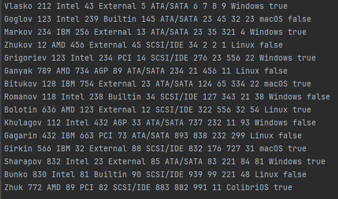
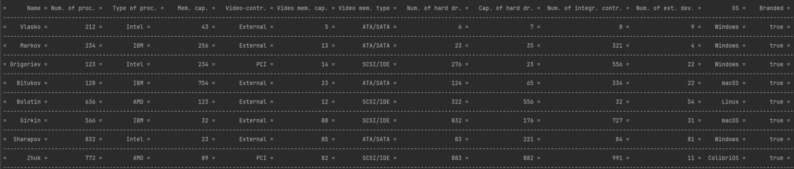

# Отчет по лабораторной работе № КП VI
## по курсу "Алгоритмы и структуры данных"

Студент группы М8О-108Б-23 Власко Михаил Михайлович

Работа выполнена

Преподаватель: каф. 806 Севастьянов Виктор Сергеевич

1. **Тема**: Обработка последовательной файловой структуры на языке Си
2. **Цель работы**: Разработать последовательную структуру данных для представления простейшей базы данных на файлах в
СП Си в соответствии с заданным вариантом.
3. **Задание (Вариант №10)**: Сведения о составе комплектующих личных ПЭВМ в студенческой группе. Составить список
компьютеров с фирменными комплектующими.
4. **Идея, метод, алгоритм решения задачи**:
    - Разработать структуру, представляющую сведения об отдельном компьютере.
    - Реализовать функции, последовательно сохраняющие структуры в файле, преобразующие текстовый в файл с записями
в структуру, ввод и сохранение отдельной записи из стандартного ввода, вывод всех хранящихся в файле записей в консоль 
в виде таблицы.
    - Реализовать функцию, выводящую только записи о компьютерах с фирменными комплектующими.
5. **Сценарий выполнения работы**:
    1. Ввести структуру `typedef struct Computer`, содержащую поля со сведениями о комплектующих каждого компьютера.
    2. Для полей, содержащих данные о типе видеопамяти и видеоконтроллера ввиду ограниченного числа значений ввести
отдельные типы перечисления. Ввести функции для преобразования значений этих типов в строковые представления и обратно.
    3. Ввести функцию, последовательно считывающую строковые записи из текстового файла, создающую экземпляр ранее
введённой структуры с соответствующими считанной строке, и далее сохраняющую созданную структуру в нетекстовый файл
(базу данных).
    4. Ввести функцию, последовательно считывающую данные о компьютере из стандартного ввода и возвращающую экземпляр
структуры с введёнными данными.
    5. Ввести функцию, последовательно считывающую структуры из нетекстового файла и выводящую их данные в консоль
в виде отформатированной таблицы.
    6. Ввести функцию, аналогичную предыдущей, выводящую только записи о компьютерах с фирменными комплектующими,
посредством проверки истинности соответствующего поля.
    7. В главной функции считывать параметры командной строки и выполнять соответствующие действия посредством ранее 
введённых функций.

6. **Листинг**:
   - Пример входных данных текстового файла:
   
     
   
   - Вывод обработанных данных компьютеров с фирменными комплектующими:
     
      
   
   - Файлы с исходным кодом программы на языке Си и Makefile: [dev](dev).

7. **Замечания автора** по существу работы: отсутствуют.
8. **Выводы**: Разработана программа создание и обработки последовательной файловой структуры на языке Си. Получен
опыт создания и взаимодействия с простейшей базой данных, чтения и записи нетекстовых файлов.